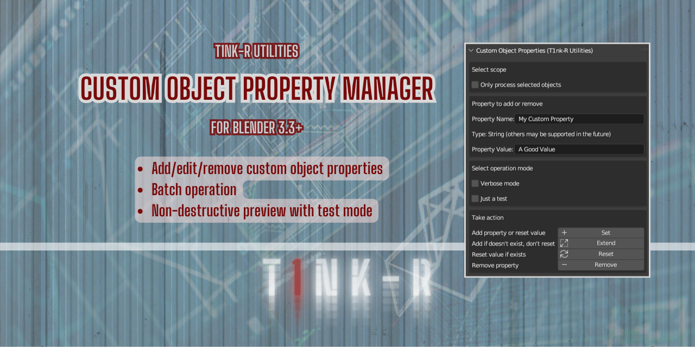

# T1nk-R Custom Object Property Manager for Blender

Part of **T1nk-R Utilities for Blender**

Version: Please see the `version` tag under `bl_info` in `__init__.py`.

## TL;DR

You can use this add-on to add, edit and remove custom object properties for specific objects or in batches. You need Blender 3.3 or newer for this addon to work.

But why on Earth would you want to manage custom object properties? Well, scripts and add-ons, such as [T1nk-R Focus Wizard](https://github.com/gusztavj/Focus-Wizard), another member of of **T1nk-R Utilities for Blender**, may make use of such properties to know what objects to process and how.

You need Blender 3.3 or newer for this add-on to work.

[View tutorial in T1nk-R's YouTube channel](https://youtu.be/d30eEzWqiQI)

Help, support, updates and anything else: [https://github.com/gusztavj/Custom-Object-Property-Manager](https://github.com/gusztavj/Custom-Object-Property-Manager)

## Legal Stuff

### Copyright

This add-on has been created by [T1nk-R (https://github.com/gusztavj/)](https://github.com/gusztavj/).

#### MIT License

Copyright (c) 2023, T1nk-R (Gusztáv Jánvári)

Permission is hereby granted, free of charge, to any person obtaining a copy of this software and associated documentation files (the "Software"), to deal in the Software without restriction, including without limitation the rights to use, copy, modify, merge, publish, distribute, sublicense, and/or sell copies of the Software, and to permit persons to whom the Software is furnished to do so, subject to the following conditions:

The above copyright notice and this permission notice shall be included in all copies or substantial portions of the Software.

THE SOFTWARE IS PROVIDED "AS IS", WITHOUT WARRANTY OF ANY KIND, EXPRESS OR IMPLIED, INCLUDING BUT NOT LIMITED TO THE WARRANTIES OF MERCHANTABILITY, FITNESS FOR A PARTICULAR PURPOSE AND NONINFRINGEMENT. IN NO EVENT SHALL THE AUTHORS OR COPYRIGHT HOLDERS BE LIABLE FOR ANY CLAIM, DAMAGES OR OTHER LIABILITY, WHETHER IN AN ACTION OF CONTRACT, TORT OR OTHERWISE, ARISING FROM, OUT OF OR IN CONNECTION WITH THE SOFTWARE OR THE USE OR OTHER DEALINGS IN THE SOFTWARE.

#### Commercial Use

I would highly appreciate to get notified via [janvari.gusztav@imprestige.biz](mailto:janvari.gusztav@imprestige.biz) about any such usage. I would be happy to learn this work is of your interest, and to discuss options for commercial support and other services you may need.

### Disclaimer

This add-on is provided as-is. Use at your own risk. No warranties, no guarantee, no liability, no matter what happens. Still I tried to make sure no weird things happen:

* This add-on may add and delete custom object properties based on your instructions.
* This add-on is not intended to modify your objects and other Blender assets in any other way.
* You shall be able to simply undo consequences made by this add-on.

You may learn more about legal matters on page [https://github.com/gusztavj/Custom-Object-Property-Manager](https://github.com/gusztavj/Custom-Object-Property-Manager)

## Usage and Help

### What's the Purpose?

This addon helps adding, editing and removing custom properties of Blender objects. You can make a good use of it if you need to:

* Add a custom property to many objects
* Reset the value of a custom property to a specific value for many objects
* Add a custom property to objects which do not yet have it, without changing the value for those objects which already have it
* Delete a custom property from many objects

### Reference

The panel looks like this:

#### Set Scope

* **Only process selected objects**. When checked, only selected objects will be processed, otherwise all objects in the view layer of the current scene.

#### Configure Property

* **Property name.** Type the name of the property to set, extend, reset or remove.
* **Property value.** Type the value of the property. The value is not observed when removing the property.

#### Operation Mode

* **Verbose mode**. When checked, the log in the **System Console** will detail what is happening. For example it will list all objects in the scope and all modifiers processed. Otherwise the log will only list changes made.
* **Just a test**. When checked, nothing will actually happen. Open the **System Console** and learn the effects of your settings before actually applying them.

#### Take action

* **Set.** Process all object in the scope, and
  * add the property to objects not yet having this property, and
  * reset the property value to **Property Value** for objects already having this property.

* **Extend.** Process all object in the scope, and add the property to objects not yet having this property. If an object already has this property, it's value won't be changed.

* **Reset.** Process all object in the scope, and reset the property value to **Property Value** for objects already having this property. If an object doesn't have this property, it won't be added.

* **Remove.** Process all object in the scope, and remove this property from each having it.

You can check if your operation succeeded on the **Object** tab of the **Properties** editor of Blender as shown below:

